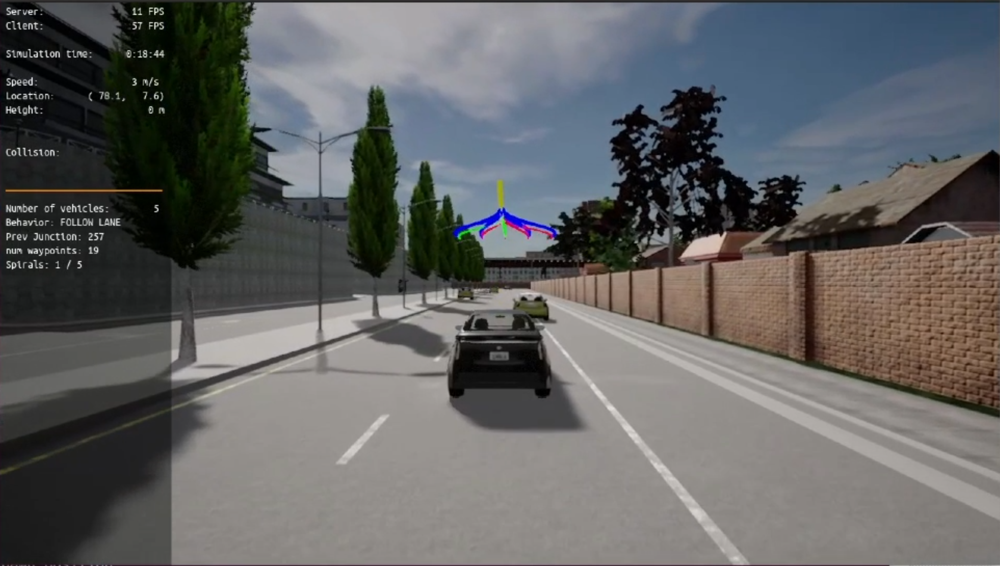
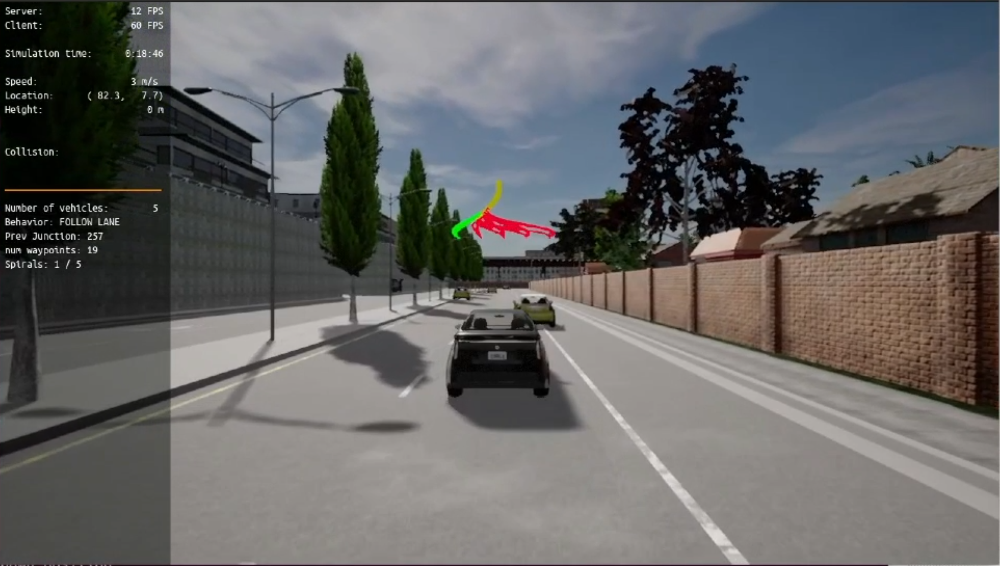
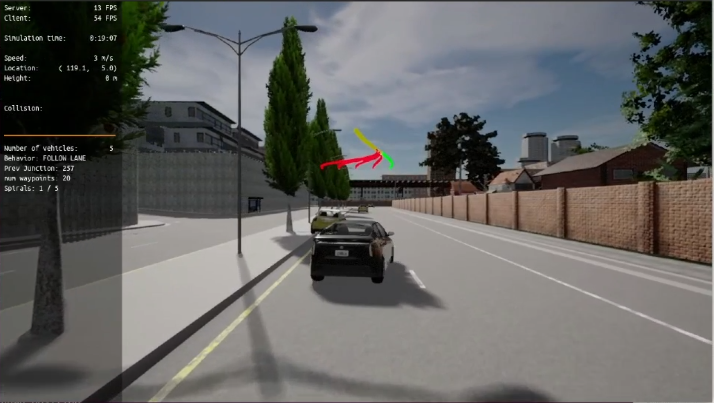
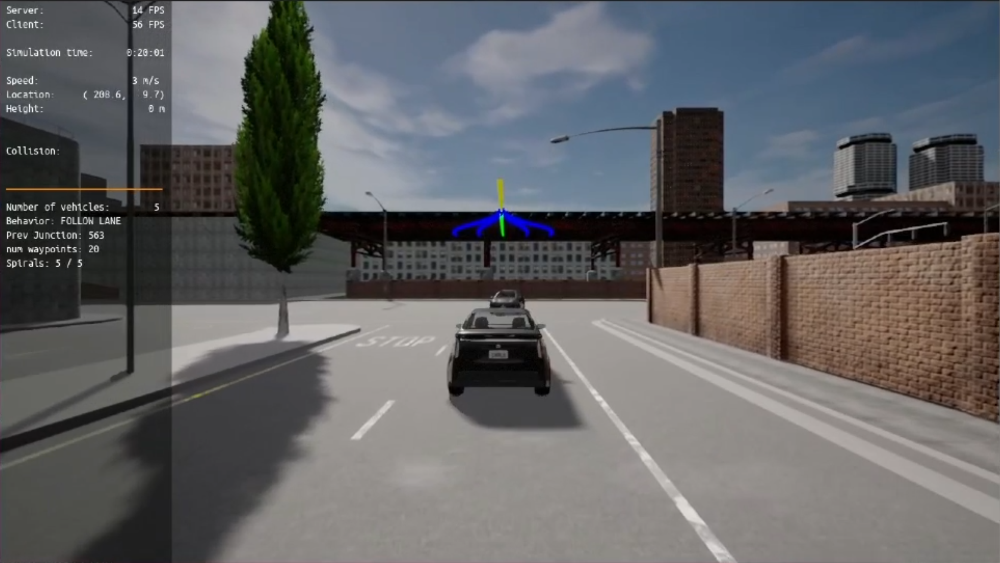

# SDCND05_Motion_Planning_and_Decision_Making
Project 5 of Udacity's "Self-Driving Car Engineer" Nanodegree Program about motion planning and decision making for automomous vehicles.  
  
## Purpose of This Project
In this project, you will implement two of the main components of a traditional hierarchical planner: The Behavior Planner and the Motion Planner. Both will work in unison to be able to:

- Avoid static objects (cars, bicycles and trucks) parked on the side of the road (but still invading the lane). The vehicle must avoid crashing with these vehicles by executing either a “nudge” or a “lane change” maneuver.
- Handle any type of intersection (3-way, 4-way intersections and roundabouts) by STOPPING in all of them (by default)
- Track the centerline on the traveling lane.

To accomplish this, you will implement:
- Behavioral planning logic using Finite State Machines - FSM
- Static objects collision checking.
- Path and trajectory generation using cubic spirals
- Best trajectory selection though a cost function evaluation. This cost function will mainly perform a collision check and a proximity check to bring cost higher as we get closer or collide with objects but maintaining a bias to stay closer to the lane center line.
  
## Project Setup Instructions
Run the following commands to install the starter code in the Udacity Workspace:
https://github.com/udacity/nd013-c5-planning-starter/blob/master/README.md

I used the Virtual Machine that supplied by Udacity to do my project.
You should install Github CLI to clone the project easier:
> sudo apt update
> sudo apt install gh

## Simulation Results
Fig. 1 - 4 show some exemplary screenshots of the project's test case simulation using [CARLA](https://carla.org/). The trajectories in blue color show the potential tracks that have been evaluated. The red tracks are the ones which would lead to a collsion, and thus, cannot be taken. The green track is the actual track that has been chosen. The level of the trajectories in vertical direction shown in the screenshots is proportional to the planned velocity. When the ego vehicle decelerates the curves go down, for instance, or visce versa if the ego vehicle accelerates.  

  
  
*Fig 1: Ego vehicle at the start point, the lane doesn't have any obstacles within the lookahead range*  
  
  
  
*Fig 2: Ego vehicle avoids an obstacle (a parking car) on the right by executing a nudging maneouver to the left.*  
  
  
  
*Fig 3: Ego vehicle avoids an obstacle (a parking car) on the left by executing a nudging maneouver to the right*  
  
  
  
*Fig 4: Ego vehicle slows down towards the stop line and finally stop.*  
  
## License
Remarks: Since the the code in this repository was build on the [starter code](https://github.com/udacity/nd013-c5-planning-starter) provided by Udacity, it automatically falls under the Udacity license, too:

[LICENSE.md](./LICENSE.md)

This also applies to the changes, extensions or modifications implemented by the code owner, s. [CODEOWNERS](./CODEOWNERS).
